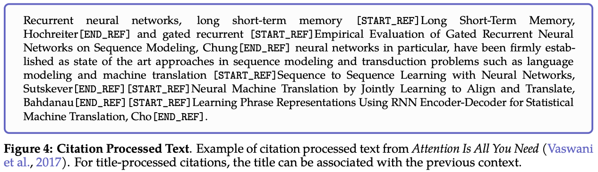
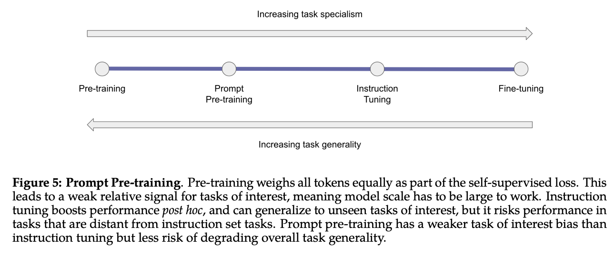
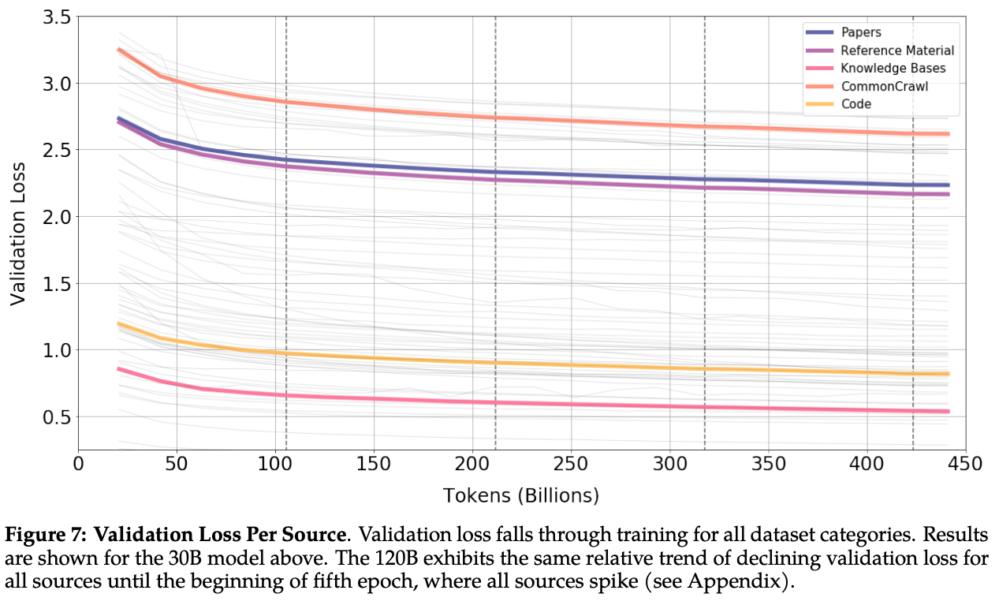
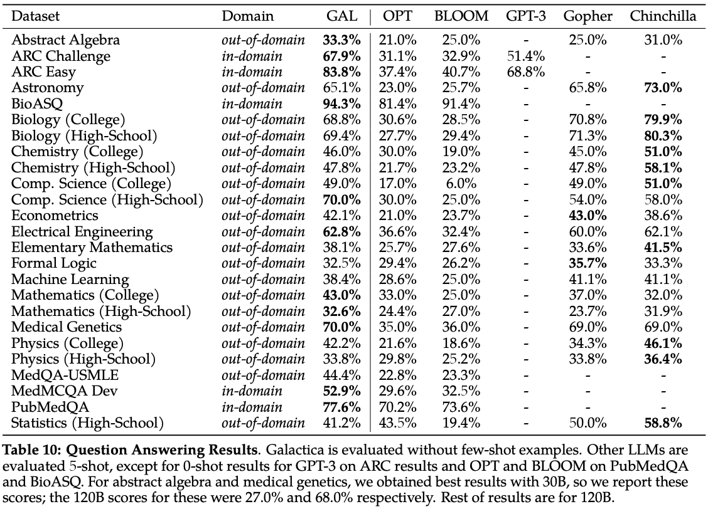
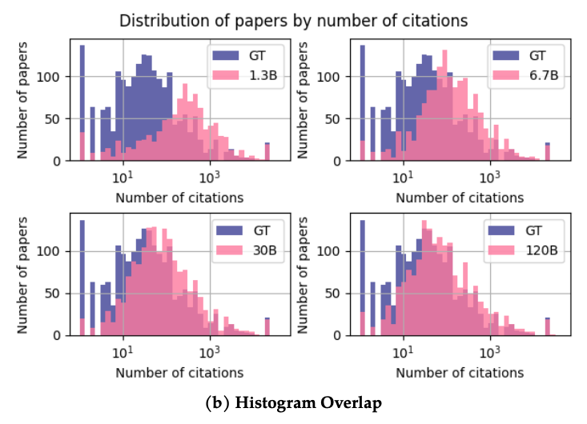

# [Galactica: A Large Language Model for Science](https://arxiv.org/abs/2211.09085v1) 🪐

🖊️ Authors: Ross Taylor, Marcin Kardas, Guillem Cucurull, Thomas Scialom, Anthony Hartshorn, Elvis Saravia, Andrew Poulton, Viktor Kerkez, Robert Stojnic

🎙️ Presenter: [Moreno La Quatra](https://www.mlaquatra.me)


---

# Keep it short and simple

Galactica is a new LLM created by [Papers with Code](https://paperswithcode.com/) and [Meta](https://www.meta.com/). It is trained on a large scientific corpus and is available for free to the research community.

Prompt: **The Schwarzschild radius is defined as:**

Generated text: 

**The Schwarzschild radius is defined as:** 

$[r_{s}=\frac{2GM}{c^{2}}]$

where $(G)$ is the gravitational constant, $(M)$ is the mass of the black hole, and ...

---

# Before anything else - Poll

1. How many of you have used a LLM in your research?
2. Do you want to try a demo of Galactica with your own prompt?

<center>
    <a href="https://huggingface.co/spaces/morenolq/galactica-base">https://huggingface.co/spaces/morenolq/galactica-base</a>
</center>

---

# Just another LLM?

- Both researchers and general public have been fascinated by the power of generative language models.

- GPT-3, in 2020, was already able to generate news articles, html pages, and even entire essays.

- The fluency of the generated text was impressive and it was clear that the model was able to fool the human eye (well, brain!).


---

# Just another LLM?

Galactica does not differ much from GPT-3. They share a similar architecture and some of the pre-training tasks. 

How one can train a decoder-based LLM using self-supervised learning?

```
Input: The cat sat on 
Target: The cat sat on the

Input: The cat sat on the
Target: The cat sat on the mat

...
```

---

# Just another LLM?

Simple next-word prediction task.

Despite the simplicity of the task, the model is able to learn a lot of information about the language: its structure, its vocabulary, its syntax, its semantics, etc.

---

# Just another LLM?

So, Galactica is just another LLM? Not really.

- Galactica is proposed as a LM for **science**.
- Similar to GPT-3, Galactica is able to mimic the style found in training data and generate text that is fluent and scientifically-styled.
- Galactica is able to generate text that is **factually correct**? NO! It is not intended to solve factual correctness in NLP.


---

# Galactica 🪐

While it is true that Galactica is very similar to other LLMs, it is also true that it is different in some aspects.

1. **Dataset**

Galactica is trained on a corpus containing 48 million scientific papers (83% of the total size of the corpus), 2 million code snippets, 8 million documents from reference material, 2 million entries from knowledge bases, and other documents both from the web and from the scientific domain.

For reference, [OPT](https://arxiv.org/abs/2205.01068) is trained on a mix of [common crawl](https://commoncrawl.org/), [the pile](https://pile.eleuther.ai/), and other datasets (`180B` tokens for OPT vs `106B` tokens for Galactica).


---

# Galactica 🪐

2. **Working Memory Token, `<work>`**

> Transformer-based architectures lack an explicit working memory capability, which means a single-forward pass has limited efficacy.

*Chain-of-thought prompting* is a technique used to enhance the performance of LLMs by providing it with the ability to generate step-by-step process to solve a problem. In Galactica, the authors propose to encode this idea directly in the model by adding a specific token to the vocabulary `<work>`.

---

# Galactica 🪐


---

# Galactica 🪐

3. **Citation tokens, `[START_REF]`, `[END_REF]`**

One of the distinctive features of scientific papers is the presence of citations. In Galactica, the authors propose to encode this idea directly in the model by adding specific tokens to the vocabulary.

The authors evaluate different citation formats but the best results are obtained by using the following format:

```
[START_REF] <paper title>, <first author last name> [END_REF]
```

It makes sense to use the paper title as it includes relevant information about the topic of the paper.

---

# Galactica 🪐



---

# Galactica 🪐

4. **Prompt Pre-Training**

Another important difference with respect to other LLMs is the use of prompt pre-training. Galactica is trained **also** using prompting during training to boost the performance on downstream tasks (e.g., question answering) and to augment the training data. A few considerations:

- The number of prompts is quite limited.
- It surely helps to improve the performance of the model on QA-like tasks.
- How model performance can be improved by using a larger and more diverse set of prompts during training?


---

# Galactica 🪐




---

# Results

The results of Galactica are quite impressive. The model is tested on a pletora of tasks and it performs very well. Does this mean that Galactica is a good model for science? The choice is yours.

Before diving into the discussion, let's summarize some takeaways from the paper.

---

# Results - Multiple epochs

Recent works have shown that multiple pre-training epochs on the same (*huge!*) dataset can be harmful for the performance of LLMs ([Scaling Laws and Interpretability of Learning from Repeated Data.](https://arxiv.org/abs/2205.10487)).

The authors of Galactica show that the performance of Galactica continues to improve even after multiple epochs of pre-training. Why?

1. The dataset used for pre-training is very large but curated.
2. The dataset include scientific text that can have an *higher value per token* than other datasets (e.g., common crawl).


---

# Results - Multiple epochs




---

# Results - Latex equations

When prompted with a description of a formula, Galactica generates the corresponding latex code.


<br>

Do you imagine how useful this can be?

---

# Results - Latex equations


---

# Results - Reasoning

The `<work>` token is used to wrap text including the detailed steps to finally generate the result. When compared with other LLMs, Galactica is able to more accurately generate the result of a process.

It is worth noting that **Galactica 30B** model is already able achieve very good performance considering the size of the model

---

# Results - Reasoning


---

# Results - Scientific NLP

The authors evaluate Galactica on a set of scientific NLP tasks. The model is asked to generate answers to questions about knowledge-intensive tasks from multiple domains and knowledge levels (e.g., high school, college, and graduate school).

---

# Results - Scientific NLP



---

# Results - Scientific NLP

A few interesting observations:
1. The authors report that the model may be biased towards graduate-level knowledge.
2. Considering in-domain performance, the model is able to outperform all competitors
3. Considering out-of-domain performance, the model shows good performance overall
4. The GPT-3 results are only available for a few tasks, why? I don't know. Even for other competitors the results are not available for all tasks.


---

# Results - Citations prediction

Here's a task that I find very interesting. The model is evaluated on the task of predicting the citation of a paper given the left-side context.

The model is prompted with a text similar to the following one:

```
FP-growth is a frequent pattern mining algorithm for transactional databases [START_REF]
```

and asked to generate the following text:

```
FP-growth is a frequent pattern mining algorithm for transactional databases 
[START_REF]Mining frequent patterns without candidate generation, Han[END_REF]
```

---

# Results - Citations prediction

The model is compared with sparse and dense retrieval models (**those are the ones we use today for citation lookup**).


---

# Results - Citations prediction

One of the possible criticism, in this case, is that the model can be biased towards the most cited papers. That can be true, but the authors report that the bias is mitigated by the size of the model.



---

# Results

A lot of additional results are reported in the paper. They include biological understanding, drug discovery, chemical understanding and many more. I **strongly encourage** you to read the paper to learn more about the results.

---

# Discussion

The paper proposes Galactica as a LLM for **science**. What are the threats to this claim? 

The authors advertise Galactica as a model that can be used to generate scientific papers and they provide a public demo to show the impressing capabilities of the model.

I think that the authors are a bit too optimistic about the capabilities of the model and managed to create a lot of hype around the model.

Let's discuss a few points!

---

# Discussion - Factuality

Generative models, expecially in the NLP domain, can generate very fluent text but they are not able to guarantee the factual correctness of the generated text. 

Galactica is **not** an exception.

The problem of hallucinated content is a very common problem in the NLP domain and **the authors are aware of it**. 

*I wish most of the tweets about Galactica would have included a disclaimer about the fact that the tweeter has read the paper or not.*

---

# Discussion - Misinformation

The model can be used to generate fake information that really sounds like it is correct.

The model is just amazing at speaking the language of science. It can generate text that is very similar to the text written by a scientist. Is that a problem? The choice is yours.

My take? I think that **it is not**. 

Generating fake news **is a problem**, but it is not a problem of the model. It is a problem of the people using the model. The model is just a tool. 

Let's stop one moment and discuss about this.

---

# Discussion - Academic companion

The best way to think about Galactica is as an academic companion. It can help you to generate text that is very similar to the text written in a scientific paper.

The model can help you to write a paper, **but it must not write a paper for you.**

It should be a tool for scientists. You are the researcher and you know the domain, the problem, the data, the methods, and so on. You should **interact** with the model.

---

# Discussion - Academic companion

Non-native speakers can use the model to generate a first draft of a paper or to get suggestion on academic writing.

Be aware that the model will generate the text you asked for. If you ask for a section of a paper including the benefits of *eating glass*, the model will follow your instructions and will do its best to generate a scientifically sounding text. **Don't blame the model for that.**

---

# Discussion - Academic companion

Standing on the shoulders of a giant, I report here a tweet from Prof. Yann LeCun that best summarizes my opinion about the model:

<blockquote class="twitter-tweet"><p lang="en" dir="ltr">This tool is to paper writing as driving assistance is to driving.<br>It won&#39;t write papers automatically for you, but it will greatly reduce your cognitive load while you write them. <a href="https://t.co/0WgR8DWUV6">https://t.co/0WgR8DWUV6</a></p>&mdash; Yann LeCun (@ylecun) <a href="https://twitter.com/ylecun/status/1592677381818691584?ref_src=twsrc%5Etfw">November 16, 2022</a></blockquote> <script async src="https://platform.twitter.com/widgets.js" charset="utf-8"></script>

---

# The end!

I hope you enjoyed the talk. I am looking forward to your questions and comments.